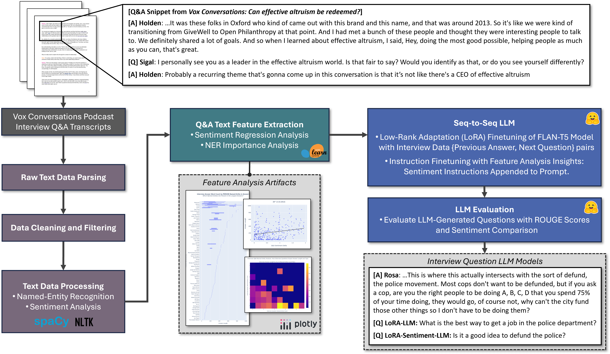
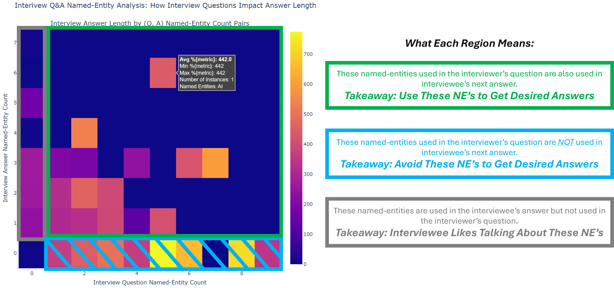
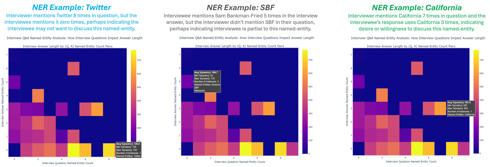
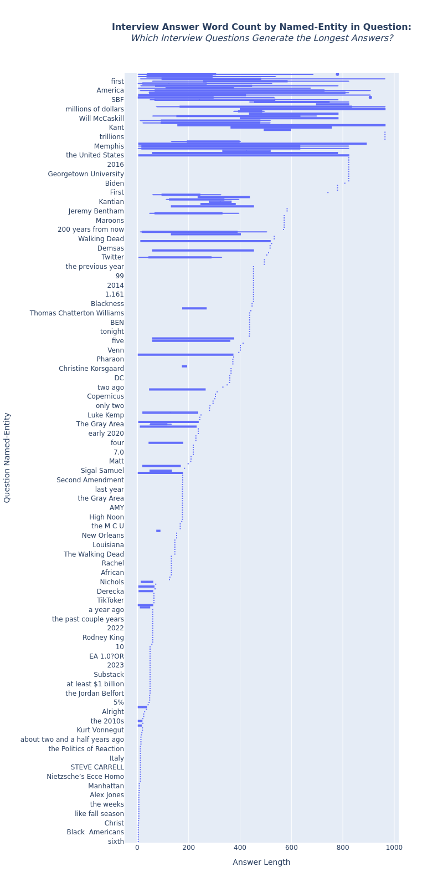
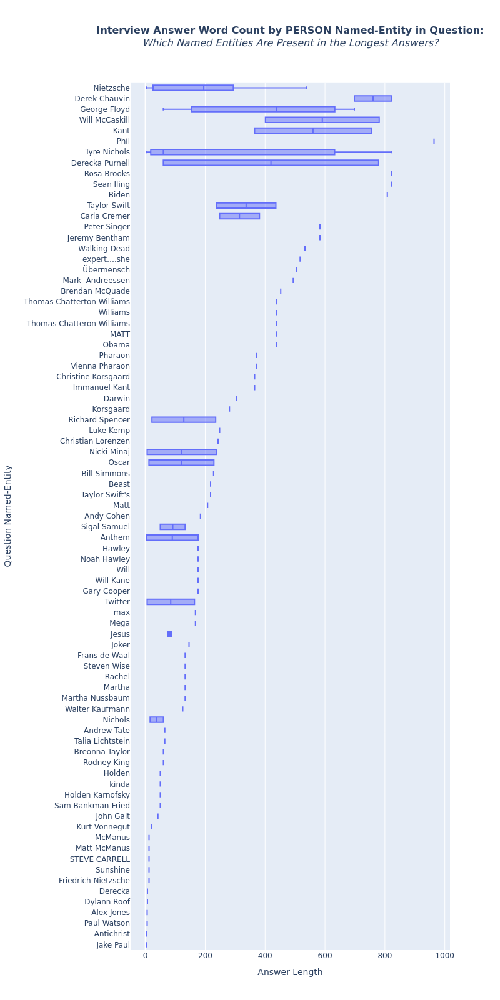

# Overview

#### Background 

Increasing case throughput in the legal domain will involve multiple tiers of automation. Generally speaking, the first tier will include automating routine tasks like sending follow-up emails. The second tier of automation will require greater domain knowledge, including automoating interrogatories and requests for admission. Automating these tasks will not only increase case flow by reducing errors and manual labor hours, but these tasks can also be improved by learning the most effective features and patterns of each task/form based on historical datasets. For example, an ML model could learn to craft interrogatories that minimize the probablity of yielding an objection from the opposing attorney. Finally, the third tier has the widest scope: analyzing case structures, case outcomes, policy details, current events, and other historical data to learn to discover new cases. Like AlphaFold discovering protein structures or FunSearch "discovering" mathematics, a legal AI model could be designed to learn the principles and underlying structures of legal cases to discover future cases. This repository is a brief ML project focusing on one application related to the second tier. As a proxy to building an ML model to generate interrogatories for which there is limited open-source data, this repository builds an ML model to generate generic podcast interview questions.

#### Project Description

This repository generates interview questions based on question-and-answer dialogue in Q&A podcasts. This repository uses open-source Vox Conversations podcast transcripts due to its question-answer format. The transcript files are parsed, cleaned, filtered, tokenized, and processed using pandas, SpaCy and NLTK libraries. Processing includes labeling data entries with sentiment and named-entity recogntion (NER) labels. A feature extraction module performs basic analysis tasks with regression and visualization tools to understand how different sentiment and named-entities affect the interviewee's reponse to questions. A FLAN-T5 LLM is finetuned with the processed Q&A dataset with {previous answer, next question} pairs to train the LLM to generate effective questions based on the previous interviewee answer. Instruction finetuning is used to add sentiment instructions into the prompt based on the insights from feature analysis. Finally, the generated questions are compared to the actual interview question via ROUGE scores and sentiment values for completeness of the procedure. 

#### Conclusions

This repository could be applied to legal data to generate interrogatories instead of interview questions. The interview answer length metric was chosen because of its relevance to extracting as much information as possible from the opposing legal party with an interrogatory question. Other metrics like probability of objection could be added. Moreover, the analysis of understanding how named-entities and sentiment affect answer length, could be applied to generating interrogatories with specific NER and sentiment characteristics that optimize interrogatory performance. 

# System Design



# Dataset and Preprocessing

Transcripts from the Vox Conversations podcast that were used to create this dataset were pulled from the [Vox publicly available file share](https://drive.google.com/drive/folders/1CYMwQX04RghOK4qN3Tfaih9dJnPa8jnt). 

The `TranscriptDataset` class is used to preprocess the transcript text files into json data and metadata files. The NLP functions in `language.py` filter the data and implement NER and sentiment analysis using SpaCy and NLTK. 

# Feature Analysis

#### Named-Entity Q&A Representation Analysis

This analysis looks at how named-entities are represented in Q&A pairs. Each question and answer is analyzed for named-entity counts, then the previous answer named-entities are compared with the next question named-entities, creating a heatmap as shown below. Each heatmap cell is colored by the average answer length for that pair of (number of question named-entities, number of answer named-entities). The following annotaed charts walkthrough difference cases for combinations of named-entities with examples. Click on the picture to open a high resolution view.

**[This chart is interactive, give it a try here!](https://ayruthe.github.io/cut-above-questions/)**






#### Named-Entity Q&A Answer Length Analysis

The chart on the left shows the distribution of answer length per labeled named-entity for all NER types. The chart on the right shows the distribution of answer length for PERSON NER types only. These charts give some insight into what NE's are related to longer answers. For example, some interviewees give long responses including Nietzsche and Memphis, while some give short responses for NE's Kurt Vonnegut and Manhattan.  

Answer Length by NER in Question for All NER Types          |  Answer Length by NER in Question for Person NER
:-------------------------:|:-------------------------:
  |  


# Generated Interview Question Examples

A couple of LLM generated responses with their scores and associate Q&A pair are shown in the tables below. These results aren't groundbreaking, but they do reflect the effects of finetuning the LLM on the Q&A dataset by generating more interesting questions. The inclusion of the sentiment prompt instruction also has a noticable impact, making some answers more dramatic.

The prompt templates used are below. The first template is for the vanilla and LoRA-finetuned models. The second template includes the added sentiment instruction.

#### Prompt 1

```
prompt = f"""
Ask an inquisitive interview question in response to the following dialogue.
{prev_answer}
Question:
"""
```

#### Prompt 2

```
sentiment_prompt = f"""
Ask an inquisitive interview question in response to the following dialogue. Respond with {pos_neg} sentiment.
{prev_answer}
Question:
"""
```

### Example 1

|           | Previous Interview Answer (Truth)                                                                                                                                                                                                                                                                                                                        | Next Interview Question (Truth)                                                                                                                                                                                                                                                                                                                                                                                                                                                                            | Vanilla FLAN-T5 Question (Generated)    | LoRA-Finetned FLAN-T5 Question (Generated)                  | LoRA-Finetned FLAN-T5 with Sentiment-Prompted<br />Question (Generated)   |
|:----------|:---------------------------------------------------------------------------------------------------------------------------------------------------------------------------------------------------------------------------------------------------------------------------------------------------------------------------------------------------------|:-----------------------------------------------------------------------------------------------------------------------------------------------------------------------------------------------------------------------------------------------------------------------------------------------------------------------------------------------------------------------------------------------------------------------------------------------------------------------------------------------------------|:----------------------------------------|:------------------------------------------------------------|:------------------------------------------------------------|
| Text      | Rosa: This is where this actually intersects with the sort of defund, the police movement.  Most cops don't want to be defunded, but if you ask a cop, are you the right people to be doing A, B, C, D that you spend 75% of your time doing, they would go, of course not, why can't the city fund those other things so I don't have to be doing them? | Sean: I do wanna talk about how the profession is structured, though. Of course, there's a  discussion to be had here about the culture of policing and how it's broken and I think a helpful place to start is with the militarization of policing and a lot of the discourse, as you know, focuses on the gear and the hardware and the tactics, and that's all worth knowing. But I know you think the more profound problem here is how police departments are organized. Can you say a bit about that? | What is the main idea of the interview? | What is the best way to get a job in the police department? | Is it a good idea to defund the police?                     |
| Sentiment | -0.0626                                                                                                                                                                                                                                                                                                                                                  | -0.3353                                                                                                                                                                                                                                                                                                                                                                                                                                                                                                    | 0.0                                     | 0.6369                                                      | 0.4404                                                      |
| Rouge-1   | --                                                                                                                                                                                                                                                                                                                                                       | --                                                                                                                                                                                                                                                                                                                                                                                                                                                                                                         | 0.0256                       | 0.0678                                                      | 0.0256                                                |
| Rouge-2   | --                                                                                                                                                                                                                                                                                                                                                       | --                                                                                                                                                                                                                                                                                                                                                                                                                                                                                                         | 0.0                                     | 0.0                                                         | 0.0                                                         |

### Example 2

|           | Previous Interview Answer (Truth)                                                                                                                                                                                                                                                                                                                                                                                                                                                                                                                                                                                                                                                                                                                                                                                                                                                                                                                                                                                                                                                                                                                                                                                                                                                                                                                                                                                                                                                                                                                                                                                                                                                                                                                                                                                                                                                                                                                                                                                                                                                                                                                                                                                         | Next Interview Question (Truth)                                                                                                                                            | Vanilla FLAN-T5 Question (Generated)    | LoRA-Finetned FLAN-T5 Question (Generated)                                                      | LoRA-Finetned FLAN-T5 with Sentiment-Prompted Question (Generated)   |
|:----------|:--------------------------------------------------------------------------------------------------------------------------------------------------------------------------------------------------------------------------------------------------------------------------------------------------------------------------------------------------------------------------------------------------------------------------------------------------------------------------------------------------------------------------------------------------------------------------------------------------------------------------------------------------------------------------------------------------------------------------------------------------------------------------------------------------------------------------------------------------------------------------------------------------------------------------------------------------------------------------------------------------------------------------------------------------------------------------------------------------------------------------------------------------------------------------------------------------------------------------------------------------------------------------------------------------------------------------------------------------------------------------------------------------------------------------------------------------------------------------------------------------------------------------------------------------------------------------------------------------------------------------------------------------------------------------------------------------------------------------------------------------------------------------------------------------------------------------------------------------------------------------------------------------------------------------------------------------------------------------------------------------------------------------------------------------------------------------------------------------------------------------------------------------------------------------------------------------------------------------|:---------------------------------------------------------------------------------------------------------------------------------------------------------------------------|:----------------------------------------|:------------------------------------------------------------------------------------------------|:------------------------------------------------------------|
| Text      | Derecka: I would say it's more than just a dream. I think that there are lots of things that are  happening that can be considered abolitionist, right? So abolition is not just simply the eradication of the institution of policing or mass incarceration or the carceral state. It's also building up the kinds of people, neighborhoods, relationships, planet that we all deserve and that's always happening. Right. And so in terms of a timeline, there are different people who are fighting on different timelines for broader visions that lead towards an abolitionist future. So when I listen to climate justice activists fighting to stop emissions or fighting to stop the increase of earth's temperature by four degrees in the next 10 to like 30 years, that has abolitionist implications because the more that the planet heats up, the more there's going to be climate refugees, the more chaos there's going to be across borders. The more that governments are going to deploy police and the military to go be responsive to them. | Fabiola: Are there ever any moments when you feel like abolition just feels way too big, too  daring for us to just imagine our liberation in that way and just demand it? | What is the main idea of the interview? | What is the most important thing that you can do to help the people of your community? | Is abolition a dream?                              |
| Sentiment | -0.4722                                                                                                                                                                                                                                                                                                                                                                                                                                                                                                                                                                                                                                                                                                                                                                                                                                                                                                                                                                                                                                                                                                                                                                                                                                                                                                                                                                                                                                                                                                                                                                                                                                                                                                                                                                                                                                                                                                                                                                                                                                                                                                                                                                                                                   | 0.5423                                                                                                                                                                     | 0.0                                     | 0.5849                                                                                          | 0.25                                                        |
| Rouge-1   | --                                                                                                                                                                                                                                                                                                                                                                                                                                                                                                                                                                                                                                                                                                                                                                                                                                                                                                                                                                                                                                                                                                                                                                                                                                                                                                                                                                                                                                                                                                                                                                                                                                                                                                                                                                                                                                                                                                                                                                                                                                                                                                                                                                                                                        | --                                                                                                                                                                         | 0.0256                     | 0.0737                                                                             | 0.0667                                         |
| Rouge-2   | --                                                                                                                                                                                                                                                                                                                                                                                                                                                                                                                                                                                                                                                                                                                                                                                                                                                                                                                                                                                                                                                                                                                                                                                                                                                                                                                                                                                                                                                                                                                                                                                                                                                                                                                                                                                                                                                                                                                                                                                                                                                                                                                                                                                                                        | --                                                                                                                                                                         | 0.0                                     | 0.0                                                                                             | 0.0                                                         |
