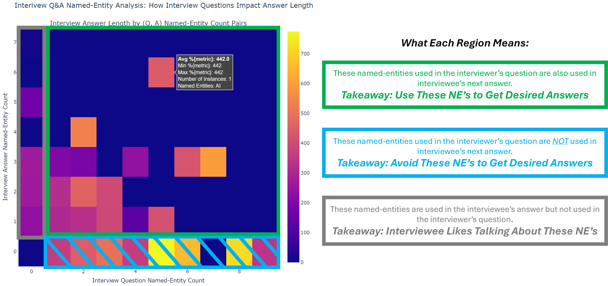

# Overview
An ML solution for generating better interview questions based on Q&amp;A dialogue in podcasts.

# System Design

Block Diagram. 

# Dataset and Preprocessing

Example transcripts. Preprocessing steps. 

# Feature Analysis

Sentiment and NER analysis.

Answer Length by NER in Question for All NER Types          |  Answer Length by NER in Question for Person NER Type
:-------------------------:|:-------------------------:
  |  

# Generated Interview Question Examples

### Example 1

|           | Previous Interview Answer (Truth)                                                                                                                                                                                                                                                                                                                        | Next Interview Question (Truth)                                                                                                                                                                                                                                                                                                                                                                                                                                                                            | Vanilla FLAN-T5 Question (Generated)    | LoRA-Finetned FLAN-T5 Question (Generated)                  | LoRA-Finetned FLAN-T5 with Sentiment-Prompted Question (Generated)   |
|:----------|:---------------------------------------------------------------------------------------------------------------------------------------------------------------------------------------------------------------------------------------------------------------------------------------------------------------------------------------------------------|:-----------------------------------------------------------------------------------------------------------------------------------------------------------------------------------------------------------------------------------------------------------------------------------------------------------------------------------------------------------------------------------------------------------------------------------------------------------------------------------------------------------|:----------------------------------------|:------------------------------------------------------------|:------------------------------------------------------------|
| Text      | Rosa: This is where this actually intersects with the sort of defund, the police movement.  Most cops don't want to be defunded, but if you ask a cop, are you the right people to be doing A, B, C, D that you spend 75% of your time doing, they would go, of course not, why can't the city fund those other things so I don't have to be doing them? | Sean: I do wanna talk about how the profession is structured, though. Of course, there's a  discussion to be had here about the culture of policing and how it's broken and I think a helpful place to start is with the militarization of policing and a lot of the discourse, as you know, focuses on the gear and the hardware and the tactics, and that's all worth knowing. But I know you think the more profound problem here is how police departments are organized. Can you say a bit about that? | What is the main idea of the interview? | What is the best way to get a job in the police department? | Is it a good idea to defund the police?                     |
| Sentiment | -0.0626                                                                                                                                                                                                                                                                                                                                                  | -0.3353                                                                                                                                                                                                                                                                                                                                                                                                                                                                                                    | 0.0                                     | 0.6369                                                      | 0.4404                                                      |
| Rouge-1   | --                                                                                                                                                                                                                                                                                                                                                       | --                                                                                                                                                                                                                                                                                                                                                                                                                                                                                                         | 0.0256                       | 0.0678                                                      | 0.0256                                                |
| Rouge-2   | --                                                                                                                                                                                                                                                                                                                                                       | --                                                                                                                                                                                                                                                                                                                                                                                                                                                                                                         | 0.0                                     | 0.0                                                         | 0.0                                                         |

### Example 2

|           | Previous Interview Answer (Truth)                                                                                                                                                                                                                                                                                                                                                                                                                                                                                                                                                                                                                                                                                                                                                                                                                                                                                                                                                                                                                                                                                                                                                                                                                                                                                                                                                                                                                                                                                                                                                                                                                                                                                                                                                                                                                                                                                                                                                                                                                                                                                                                                                                                         | Next Interview Question (Truth)                                                                                                                                            | Vanilla FLAN-T5 Question (Generated)    | LoRA-Finetned FLAN-T5 Question (Generated)                                                      | LoRA-Finetned FLAN-T5 with Sentiment-Prompted Question (Generated)   |
|:----------|:--------------------------------------------------------------------------------------------------------------------------------------------------------------------------------------------------------------------------------------------------------------------------------------------------------------------------------------------------------------------------------------------------------------------------------------------------------------------------------------------------------------------------------------------------------------------------------------------------------------------------------------------------------------------------------------------------------------------------------------------------------------------------------------------------------------------------------------------------------------------------------------------------------------------------------------------------------------------------------------------------------------------------------------------------------------------------------------------------------------------------------------------------------------------------------------------------------------------------------------------------------------------------------------------------------------------------------------------------------------------------------------------------------------------------------------------------------------------------------------------------------------------------------------------------------------------------------------------------------------------------------------------------------------------------------------------------------------------------------------------------------------------------------------------------------------------------------------------------------------------------------------------------------------------------------------------------------------------------------------------------------------------------------------------------------------------------------------------------------------------------------------------------------------------------------------------------------------------------|:---------------------------------------------------------------------------------------------------------------------------------------------------------------------------|:----------------------------------------|:------------------------------------------------------------------------------------------------|:------------------------------------------------------------|
| Text      | Derecka: I would say it's more than just a dream. I think that there are lots of things that are  happening that can be considered abolitionist, right? So abolition is not just simply the eradication of the institution of policing or mass incarceration or the carceral state. It's also building up the kinds of people, neighborhoods, relationships, planet that we all deserve and that's always happening. Right. And so in terms of a timeline, there are different people who are fighting on different timelines for broader visions that lead towards an abolitionist future. So when I listen to climate justice activists fighting to stop emissions or fighting to stop the increase of earth's temperature by four degrees in the next 10 to like 30 years, that has abolitionist implications because the more that the planet heats up, the more there's going to be climate refugees, the more chaos there's going to be across borders. The more that governments are going to deploy police and the military to go be responsive to them. | Fabiola: Are there ever any moments when you feel like abolition just feels way too big, too  daring for us to just imagine our liberation in that way and just demand it? | What is the main idea of the interview? | What is the most important thing that you can do to help the people of your community? | Is abolition a dream?                              |
| Sentiment | -0.4722                                                                                                                                                                                                                                                                                                                                                                                                                                                                                                                                                                                                                                                                                                                                                                                                                                                                                                                                                                                                                                                                                                                                                                                                                                                                                                                                                                                                                                                                                                                                                                                                                                                                                                                                                                                                                                                                                                                                                                                                                                                                                                                                                                                                                   | 0.5423                                                                                                                                                                     | 0.0                                     | 0.5849                                                                                          | 0.25                                                        |
| Rouge-1   | --                                                                                                                                                                                                                                                                                                                                                                                                                                                                                                                                                                                                                                                                                                                                                                                                                                                                                                                                                                                                                                                                                                                                                                                                                                                                                                                                                                                                                                                                                                                                                                                                                                                                                                                                                                                                                                                                                                                                                                                                                                                                                                                                                                                                                        | --                                                                                                                                                                         | 0.0256                     | 0.0737                                                                             | 0.0667                                         |
| Rouge-2   | --                                                                                                                                                                                                                                                                                                                                                                                                                                                                                                                                                                                                                                                                                                                                                                                                                                                                                                                                                                                                                                                                                                                                                                                                                                                                                                                                                                                                                                                                                                                                                                                                                                                                                                                                                                                                                                                                                                                                                                                                                                                                                                                                                                                                                        | --                                                                                                                                                                         | 0.0                                     | 0.0                                                                                             | 0.0                                                         |

# Installation 

python -m spacy download en_core_web_sm